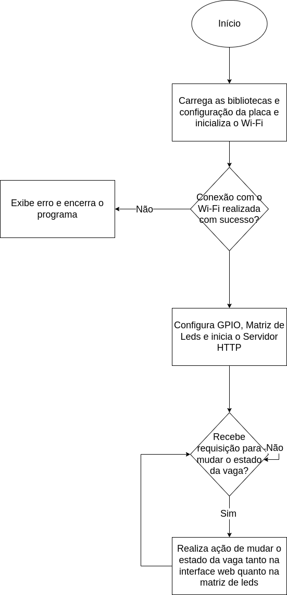

# Sistema de estacionamento

O projeto consiste em um sistema de monitoramento de vagas de estacionamento utilizando uma matriz de LEDs NeoPixel e um servidor web embarcado. O sistema permite visualizar o status das vagas (livre ou ocupada) através de uma interface web e controlar o estado das vagas via botões na página. O hardware utilizado inclui um microcontrolador Raspberry Pi Pico e uma matriz de LEDs para representar as vagas.

## Diagrama de blocos funcionais:



## Pré-requisitos

1. Ambiente Configurado:

   * Instale o Raspberry Pi Pico SDK.
   * Baixe e configure o ***lwIP*** (protocolo usado para suporte à rede no Pico W).

     i. Iniciar um projeto C/C++ na extensão da raspberry pi pico;

     ii. Mudar o tipo da placa para pico w;

     iii. Ir em “Pico wireless options” e clicar em background lwIP
   * Certifique-se de que as bibliotecas ***pico_cyw43_arch_lwip_threadsafe_background*** estão configuradas corretamente.
2. Credenciais de Wifi: Substitua o nome e a senha do Wi-Fi no código.

## Como Usar

1. Certifique-se de que o ambiente do Pico SDK está configurado.

2. Compile o projeto:
```bash
mkdir build
cd build
cmake ..
make
```

3. Após a compilação, o arquivo .uf2 estará disponível no diretório build. Faça o upload para a Pico W.
4. Com o código compilado e feito o upload na placa, é possível visualizar o endereço ip no terminal da placa BitDogLab atraves do comando:
```bash
sudo picocom -b 115200 /dev/ttyACM0
```
5. Ao entrar no endereço IP vai abrir a interface de controle do estacionamento. Altere o estado das vagas para visualizar a variação na quantidade de vagas, bem como mudanças na matriz de Leds.